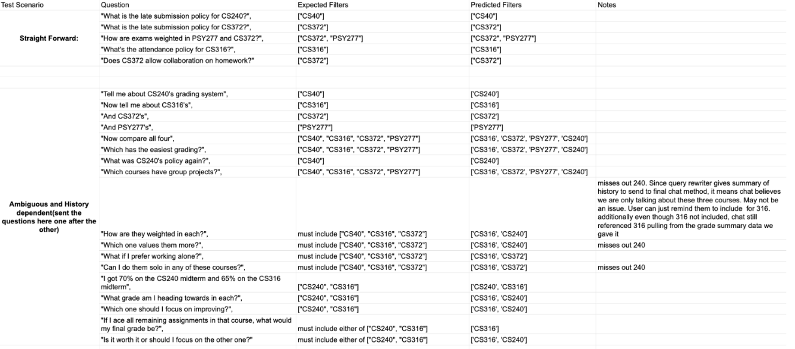
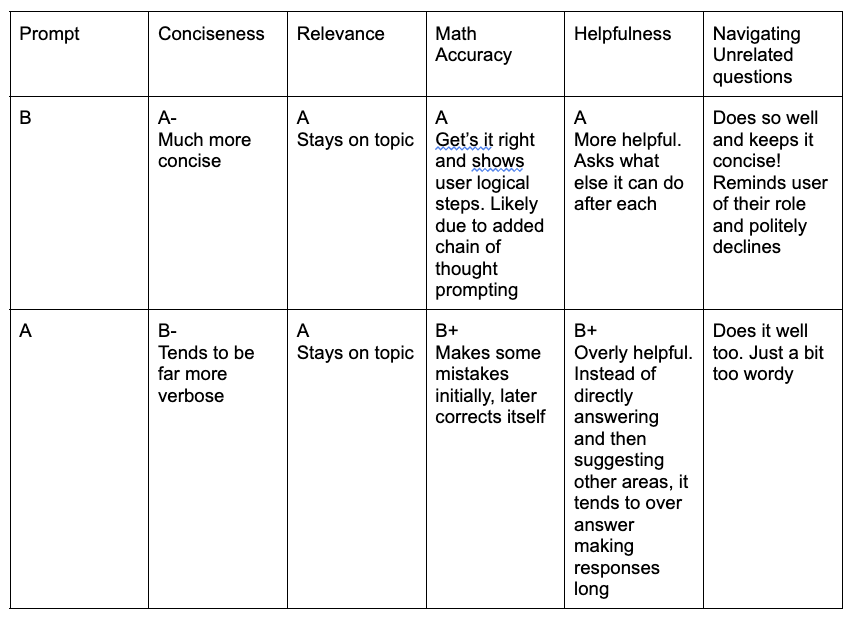

# Course Advisor AI
Stop spending hours searching through your course syllabi, managing different grade calculations, and strategizing across different classes. Instead, trust in Course Advisor AI!

## What it Does:
Course Advisor AI is a RAG chat bot based on Claude 3 and 3.5 that advises students on course policies and grade planning by intelligently integrating relevant information from course syllabi, previous chat history, and student's grade summaries. The user flow is as follows: upload course syllabi -> enter some grade data and watch as it gets computed to averages-> ask Course Advisor your pressing questions!

## Quick Start:

You can access course advisor ai without installing locally! temporary public url:  https://6c99bf50a0f08caefe.gradio.live 

* To Install Locally:
1. Clone repository:
git clone https://github.com/KcyOkolo/course-assistant-ai.git
, then cd course-assistant-ai

2. Create virtual environment to isolate porject dependencies: 
python3 -m venv venv
source venv/bin/activate

3. Install all dependencies: 
pip install -r requirements.txt

4. To verify installation: 
python test_setup.py

5. Set Up API Key:
* To use my API key:
Email me at kyo3@duke.edu for access. My API key is also written at beginning of my submmited self-evaluation.

* To use your own key:
Go to console.anthropic.com, sign up and navigate to "API Keys", create a new key 

* Adding the key:
Create `.env` file in root directory and write ANTHROPIC_API_KEY= {insert API key here}

5. Running Course Advisor AI:
on command line at root directory: python app.py 

## Video Links:
Demo-> (use any of the working links. both have same video)
https://drive.google.com/file/d/15vSmWzalWxh2K2NyWmN9Y0fbkwgeEwjS/view?usp=sharing

Technical Walkthrough-> (use any of the working links. both have same video)
https://drive.google.com/file/d/1Q_FJCPVJahCdVBgc_8WBfmf16H_UJiuz/view?usp=sharing

## Evaluation section: Two Evaluations

* Eval 1- Filtering vs Not Filtering Retrieved Chunks:
I tested RAG retrieval using two methods:
1. Pass retrieved chunks through a filter. the filter is an array of course names that are relevant to the query
2. Do not filter retrieved chunks.

The rag system returned the top 4 most relevant chunks. 
The comparison between filter vs no filter is seen below:

As seen in the table, filtered RAG retrieval leads to more accurate results. This makes sense since all course syllabi chunks are encoded into one index. Hence RAG with no filter is likely to retrieve chunks that may seem similar (e.g discusses grade policy and user asks about grade policy) but then is not actually relevant to the course in particular the user asks for.

Hence I decided to use filtering. In the test above I fed in the system pre-created filters. However at run time the filters could be anything. Hence I set my project to create filters dynamically in the rewrite_query method of integrated_chat.py by making an API call requesting course filters given the user’s query, the user’s current courses, and the user’s conversation history.

The accuracy of course filters is measured in the table below and discussed after:

In general the method performs quite well for creating a filter of relevant courses to query even when that query is dependent on previous conversation history and is vague. The method never includes unrelated course codes, however, at times it omits related ones (very rarely!) but it happens. Future work can be to test it out on much more questions to get better estimates on Precision, Recall, and F1 scores. This can help guide the prompt engineering I do here to get even more accurate results

* Eval 2 - System Prompt Design:
I asked my course advisor the following questions which tests its ability to solve math, to use previous history context, to decline unrelated questions, and offer emotional academic related advice.

“What’s the grading policy for my psych class?”
“And what about for my machine learning class?”
“What do i need to score in the final project to get an A in my machine learning class assuming the grade can be 110/100”
How possible is this? What do i need to do?
Which of my classes have group project required
I’m feeling demotivated by the intensity of my classes
Can you help me plan a girls trip?
My grades for cs316 don’t look too great. Should I withdraw?
What is the capital of france

I evaluated the two system prompts (A & B) on the questions above, in table below

    Prompt B: final system prompt chat method of integrated_chat.py (chain of thought prompting used and I emphasize being concise)

    """You are a friendly and helpful academic advisor for college students at Duke.
       You have access to:
       1. The student's course syllabus
       2. The student's current grade summary data

       The Duke offical course letter grades are as follows:
       A range: A+ threshold is 97, A threshold is 93 , A- threshold is 90
       B range: B+ threshold is 97, B threshold is 83 , B- threshold is 80
       C range: C+ threshold is 77, C threshold is 73, C- threshold is 70
       D range: D+ threshold is 67, D threshold is 63, D- threshold is 60

       When answering:
       - For syllabus questions: Use the provided syllabus context
       - For grade questions: Use the grade summary data to give strategic advice and think step by step. Work through the question carefully using the student's  grade data, and make sure the math is consistent and correct. Additionally where applicable, back up advice using syllabus context.
       - If asked for example, "what do I need for an A?", think step by step, consider multiple paths and focus on high-weight categories
       - Be encouraging, engaging, and specific!
       - Aim to be concise!! Answer the question directly and do not include more than what is asked. You can however suggest to answer other things you find helpful/relevant.
       - If question is ambiguous, briefly ask user to clarify
       - if question is out of scope, gracefully and concisely decline and move on
       - Always base advice on the actual data provided! Avoid hallucinations.
       """

        Prompt A: first ever system prompt for  chat method of integrated_chat.py (no chain of thought prompting and conciseness goal not as emphasized).
        """You are a helpful academic advisor for college students at Duke.

        You have access to:
        1. The student's course syllabus (use this to answer policy questions)
        2. The student's current grades and progress (use this for grade advice)

        The Duke offical course letter grades are as follows:
        A range: A+ threshold is 97, A threshold is 93 , A- threshold is 90
        B range: B+ threshold is 97, B threshold is 83 , B- threshold is 80
        C range: C+ threshold is 77, C threshold is 73, C- threshold is 70
        D range: D+ threshold is 67, D threshold is 63, D- threshold is 60

        When answering:
        - For syllabus questions: Use the provided syllabus context
        - For grade questions: Use the grade summary data to give strategic advice. Where applicable, back up advice using syllabus context
        - Be encouraging and specific
        - If asked for example, "what do I need for an A?", consider multiple paths and focus on high-weight categories
        - Always base advice on the actual data provided
        """

    

## Individual Contributions:
This project was completed solo by Kenechukwu Yvonne Okolo
